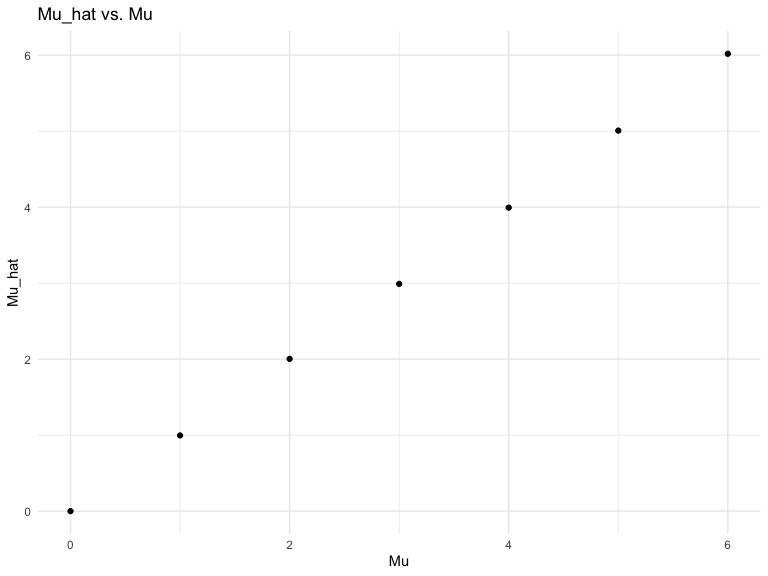

p8105_hw5_mwd2126.Rmd
================
Michael Denham
2022-11-16

### Problem 1

Skipped due to time.

### Problem 2

First, we’ll start by importing the data from the Washington Post’s
Github page.

``` r
homicide <- read.csv("https://raw.githubusercontent.com/washingtonpost/data-homicides/master/homicide-data.csv")
```

The `homicide` data frame includes `nrow(homicide)` rows and
`ncol(homicide)` columns. It includes information on about
`ncol(homicide)` homicides in 50 of the largest cities by population in
the United States. It includes the date the homicide was reported; the
victim’s name, race, age, and sex; the city, state, and geographical
coordinates of the homicide’s location; and the legal status of the
investigation.

Now we’ll create a new column with a `city_state` variable. Then we’ll
summarize within cities to obtain the total number of homicides and the
number of unsolved homicides.

``` r
homicide = homicide %>% 
  mutate(
    city_state = str_c(city, ", ", state)
  )

total_and_unsolved = homicide %>% 
  group_by(city_state) %>% 
  summarize(
    n_obs = n(),
    n_unsolved = str_count(disposition != "Closed by arrest")
  )
```

    ## `summarise()` has grouped output by 'city_state'. You can override using the
    ## `.groups` argument.

Now we look specifically at Baltimore to estimate the proportion of
homicides that are unsolved.

``` r
baltimore = homicide %>%
  filter(city_state == "Baltimore, MD")
```

I ran out of time so was unable to complete the rest of Problem 2.

### Problem 3

This problem develops a simulation to explore power in a one-sample
t-test.

First, we start by setting a seed.

``` r
set.seed(1)
```

We’ll make a function that outputs a `mu_hat` and `p_value` for each
`mu` using a one-sample t-test. We set the values for the design
elements `n` and `sigma` as 30 and 5, respectively.

``` r
sim_t = function(mu, n = 30, sigma = 5) {
  
  sim_data = tibble(
    x = rnorm(n = n, mean = mu, sd = sigma),
  )
  
  sim_data %>% 
    t.test(mu = mu) %>%
    broom::tidy() %>% 
    select(c('estimate','p.value'))
}
```

Then we run this analysis with `mu` values of 0, 1, 2, 3, 4, 5, and 6,
with 5,000 iterations for each.

``` r
sim_results_df = 
  expand_grid(
    mu = 0:6,
    iter = 1:5000
  ) %>% 
  mutate(
    estimate_df = map(mu, sim_t)
  ) %>% 
  unnest(estimate_df)
```

We’ll make a function to calculate power.

``` r
sim_power = function(mu) {
  sum(sim_results_df$mu == mu & sim_results_df$p.value <= 0.05)/5000
}
```

And now apply it to values of `mu` from 0 to 6.

``` r
powers_for_sim = 
  expand_grid(
    mu = 0:6) %>% 
  mutate(
    power_df = map(mu, sim_power)
  ) %>% 
unnest(power_df)
```

Now we’ll graph these on a plot showing the true value of `mu` (x-axis)
versus power (y-axis). Generally, as effect size goes up, power
increases.

``` r
powers_for_sim %>% 
ggplot(aes(x = mu, y = power_df)) + 
  geom_point() +
  labs(title = "Power vs. Mu") +
  xlab("Mu") +
  ylab("Power")
```


``` r
ggsave("Power_v_mu.png")
```

    ## Saving 8 x 6 in image

Now we’ll make a plot showing the average mean estimate `mu_hat` versus
the true mean `mu`.

``` r
mu_hats =
  sim_results_df %>% 
  group_by(mu) %>% 
  summarize(
    mu_hat = mean(estimate))

ggplot(mu_hats, aes(x = mu, y = mu_hat)) + 
  geom_point() +
  labs(title = "Mu_hat vs. Mu") +
  xlab("Mu") +
  ylab("Mu_hat")
```



``` r
ggsave("mu_hat_v_mu.png")
```

    ## Saving 8 x 6 in image

Then we’ll make a plot showing the average mean estimate `mu_hat` versus
the true mean `mu` only for samples in which the null was rejected.

``` r
mu_hats_rej =
  sim_results_df %>%
  filter(p.value <= 0.5) %>% 
  group_by(mu) %>% 
  summarize(
    mu_hat = mean(estimate))

ggplot(mu_hats_rej, aes(x = mu, y = mu_hat)) + 
  geom_point() +
  labs(title = "Mu_hat vs. Mu for Samples in Which the Null Was Rejected") +
  xlab("Mu") +
  ylab("Mu_hat")
```


``` r
ggsave("Mu_hat_v_mu_rej.png")
```

    ## Saving 8 x 6 in image

The sample average of `mu_hat` across tests for which the null
hypothesis is rejected is approximately equal to the true value of `mu`.
While each individual `mu_hat` value might be farther away from the
mean, when analyzed together, they still surround the true value of
`mu`.
